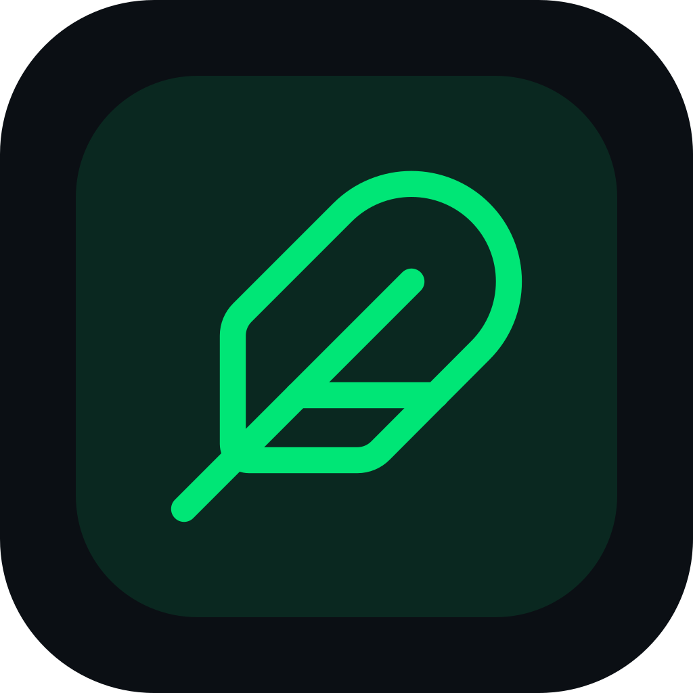

<div align="center">



# FeatherFiles for desktop

**Shrink thousands of photos and videos at once, without uploading a single file.**

Free batch optimizer for Windows, macOS and Linux. It keeps your EXIF data and original dates, and never touches your originals.


[**Download**](#download) ·
[Website](https://featherfiles.pages.dev) ·
[Try it in your browser](https://featherfiles.pages.dev/app) ·
[Report a bug](https://github.com/QuendoDev/FeatherFiles-Releases/issues/new/choose)

</div>

---

> [!NOTE]
> This repository only hosts the **installers**, **release notes** and the **issue tracker** for the FeatherFiles
> desktop app. The source code is maintained in a private repository.

## Why FeatherFiles?

- **Private by design.** Everything runs on your computer. The app has no accounts and no telemetry, and it blocks
  all network access.
- **Built for huge libraries.** Point it at a folder with tens of thousands of photos and videos, and it keeps the
  same subfolder structure.
- **Smart profiles.** Files are sorted automatically by name, folder and camera data. WhatsApp photos, camera
  shots, screenshots and videos each get the right settings.
- **Hits a target size.** For example, camera photos come out as WebP at about 300 KB with the best quality that
  fits that size, instead of a fixed quality setting.
- **Keeps what matters.** EXIF data (camera, capture date, GPS) is kept, and the creation and modification dates
  are restored, so your gallery stays in the right order.
- **Never overwrites.** The results go to a new `<Folder> (FeatherFiles)` folder next to the original one.
- **Fast video.** Videos are converted to 720p H.264, using your GPU when it is available (NVIDIA, Intel, AMD or
  Apple).

## Download

| Platform | Package | Link |
|---|---|---|
| **Windows** 10/11 (64-bit) | Installer (`.exe`) | [Latest release](https://github.com/QuendoDev/FeatherFiles-Releases/releases/latest) |
| **Linux** (64-bit) | `.AppImage` or `.deb` | [Latest release](https://github.com/QuendoDev/FeatherFiles-Releases/releases/latest) |
| **macOS** (Apple Silicon and Intel) | `.dmg` | Coming soon |

> [!TIP]
> Just need a few photos? The [web version](https://featherfiles.pages.dev/app) runs in your browser with no
> installation, and your files never leave your device there either.

All builds are compiled and packaged by GitHub Actions from a tagged commit. Each release lists the SHA-256
checksum of every file.

## Installation

<details>
<summary><strong>Windows</strong></summary>

1. Download `FeatherFiles-Setup-<version>.exe` from the [latest release](https://github.com/QuendoDev/FeatherFiles-Releases/releases/latest).
2. Run it and follow the installer. You can choose the installation folder, and administrator rights are not
   required.
3. **"Windows protected your PC"?** The installer is not code-signed yet, so Microsoft SmartScreen doesn't
   recognize it. Click **More info**, then **Run anyway**. You can compare the file's SHA-256 checksum with the
   one in the release notes:

   ```powershell
   Get-FileHash .\FeatherFiles-Setup-<version>.exe -Algorithm SHA256
   ```

To uninstall it, go to **Settings → Apps → Installed apps → FeatherFiles → Uninstall**.

</details>

<details>
<summary><strong>Linux</strong></summary>

**AppImage** (any distribution):

```bash
chmod +x FeatherFiles-<version>.AppImage
./FeatherFiles-<version>.AppImage
```

**Debian / Ubuntu**:

```bash
sudo apt install ./FeatherFiles-<version>.deb
```

On Linux, only the modification date can be restored, because the file system doesn't allow setting the
creation date.

</details>

<details>
<summary><strong>macOS</strong></summary>

A signed and notarized macOS build is on the roadmap. In the meantime, use the
[web version](https://featherfiles.pages.dev/app).

</details>

## How it works

1. **Drop a folder** or pick files. Each file is matched to a profile, and you can change any match by hand.
2. **Review the profiles.** Every profile explains what it does, and you can edit, duplicate or export them.
3. **Start.** FeatherFiles encodes each photo several times to find the best quality that fits the target
   size, converts the videos and copies the metadata.
4. **Open the results** in the new `(FeatherFiles)` folder. Your originals are exactly as they were.

## Built-in profiles

| Profile | Output |
|---|---|
| Camera photos | WebP, about 300 KB, up to 2560 px |
| WhatsApp photos | JPEG, about 150 KB, skipped if already smaller |
| Screenshots | Lossless WebP |
| Web and social | WebP, 1920 px, about 250 KB |
| Email and forms | JPEG, 1280 px, about 100 KB |
| High-quality archive | AVIF, full resolution |
| Scanned documents | JPEG, 2000 px, about 250 KB, lightly sharpened |
| Videos | H.264 720p, 1.8 Mbps, AAC audio |
| Light videos for sharing | H.264 480p, 0.9 Mbps |
| HEVC archive | H.265 1080p |
| WhatsApp videos | Copied as they are (they're already compressed) |

**Supported input formats:**
- Photos: JPEG, PNG, WebP, AVIF, HEIC/HEIF, GIF, TIFF, BMP.
- Videos: MP4, MOV, M4V, AVI, MKV, WebM, 3GP, MTS/M2TS, WMV.

## FAQ

<details>
<summary><strong>Does FeatherFiles upload my files anywhere?</strong></summary>

No. The desktop app processes everything locally and blocks all network requests. It doesn't collect any usage
data either.

</details>

<details>
<summary><strong>Will it delete or modify my originals?</strong></summary>

Never. Originals are only opened for reading, and the results are written to a separate folder. If that folder
already exists, a new one is created (`(FeatherFiles 2)`, and so on).

</details>

<details>
<summary><strong>Is it really free?</strong></summary>

Yes. The desktop app is free, with no ads, watermarks or file limits.

</details>

<details>
<summary><strong>Why is the source code not public?</strong></summary>

The project is developed privately. This repository exists so that anyone can download the builds, read the
release notes and report issues. The open-source components it bundles are listed in
[THIRD_PARTY_NOTICES.md](THIRD_PARTY_NOTICES.md).

</details>

## System requirements

- **Windows:** 10 or 11, 64-bit.
- **Linux:** 64-bit x86 with a recent glibc-based distribution (for example, Ubuntu 22.04+, Debian 12+ or
  Fedora 38+).
- **Hardware:** 4 GB of RAM (8 GB or more recommended for videos) and about 500 MB of free disk space.

## Feedback and support

- **Bugs and feature requests:** [open an issue](https://github.com/QuendoDev/FeatherFiles-Releases/issues/new/choose).
  Please search the existing issues first.
- **Security vulnerabilities:** see [SECURITY.md](SECURITY.md). Please don't open a public issue.

## License

FeatherFiles is free to download and use under the [terms of use](https://featherfiles.pages.dev/condiciones).
It is not open-source software. The bundled third-party components (FFmpeg, libvips, ExifTool and others) are
distributed under their own licenses, listed in [THIRD_PARTY_NOTICES.md](THIRD_PARTY_NOTICES.md).

Copyright © 2026 FeatherFiles.
